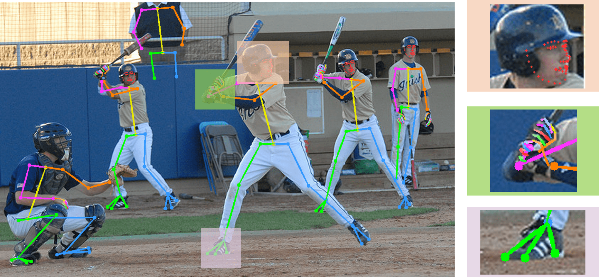

# COCO-WholeBody

This is the official repo for ECCV2020 paper ["Whole-Body Human Pose Estimation in the Wild"](https://arxiv.org/abs/2007.11858). The slides of this work can be found in [Slides](https://drive.google.com/file/d/1nebo1h07BwKDhomWy4n98X4cJ1qHVy2X/view?usp=sharing).
The repo contains COCO-WholeBody annotations proposed in this paper. Note that in our ECCV paper, all experiments are conducted on COCO-WholeBody V0.5. We further improve the annotation of the proposed dataset from V0.5 to V1.0.
The benchmark results for COCO-WholeBody V1.0 can be found in [MMPose](https://mmpose.readthedocs.io/en/latest/topics/wholebody.html#coco-wholebody-dataset). More introduction of COCO-WholeBody V1.0 is summarized in our journal version paper (to be published).

## News
[2021.3.20] Our whole-body pose estimation model has been adopted in the top-2 winning solutions ([smilelab2021](https://github.com/jackyjsy/CVPR21Chal-SLR) and [rhythmblue](https://github.com/ustc-slr/ChaLearn-2021-ISLR-Challenge)) of the [CVPR 2021 Looking at People Large Scale Signer Independent Isolated SLR Challenge](https://chalearnlap.cvc.uab.cat/challenge/43/description/). 

[2020.10.08] We put a fancy demo video to [YouTube](https://www.youtube.com/watch?v=pIJpQg8mXUU). The demo video is generated by [MMPose](https://github.com/open-mmlab/mmpose). Enjoy :)

[2020.09.19] We have supported COCO-WholeBody in [MMPose](https://github.com/open-mmlab/mmpose). A much stronger baseline model [dark_pose_hrnet_w48+](https://github.com/open-mmlab/mmpose/tree/master/configs/top_down/darkpose) with WholeBody AP 66.1% is provided for research purpose.

[2020.09.15] The evaluation tool is integrated into [Extended COCO API](https://github.com/jin-s13/xtcocoapi) for version>=1.5

To install from pip:
```shell
pip install xtcocotools
```

## What is COCO-WholeBody? 

COCO-WholeBody dataset is the first large-scale benchmark for whole-body pose estimation. 
It is an extension of [COCO 2017 dataset](https://cocodataset.org/#keypoints-2017) with the same train/val split as COCO.

Here is an example of one annotated image.



For each person, we annotate 4 types of bounding boxes (person box, face box, left-hand box, and right-hand box) and 133 keypoints (17 for body, 6 for feet, 68 for face and 42 for hands). The face/hand box is defined as the minimal bounding rectangle of the keypoints. The keypoint annotations are illustrated as follows.


## How to Use?

### Download
Images can be downloaded from [COCO 2017 website](https://cocodataset.org/#keypoints-2017).

COCO-WholeBody annotations for [Train](https://drive.google.com/file/d/1thErEToRbmM9uLNi1JXXfOsaS5VK2FXf/view?usp=sharing) / [Validation](https://drive.google.com/file/d/1N6VgwKnj8DeyGXCvp1eYgNbRmw6jdfrb/view?usp=sharing) (Google Drive).

### Annotation Format
The data format is defined in [DATA_FORMAT](data_format.md).


### Evaluation

We provide evaluation tools for COCO-WholeBody dataset. Our evaluation tools is developed based on [@cocodataset/cocoapi](https://github.com/cocodataset/cocoapi). 

We also provide an example groundtruth file (example_gt.json) and an example pred file (example_pred.json). 

Evaluate on COCO-WholeBody by running the following line:

`python evaluation/evaluation_wholebody.py --gt_file evaluation/example_gt.json --res_file evaluation/example_pred.json`

### Terms of Use

1. COCO-WholeBody dataset is **ONLY** for research and non-commercial use.

2. The annotations of COCO-WholeBody dataset belong to [SenseTime Research](https://www.sensetime.com), and are licensed under a [Creative Commons Attribution 4.0 License](https://creativecommons.org/licenses/by-nc/4.0/legalcode).

3. We do not own the copyright of the images. Use of the images must abide by the [Flickr Terms of Use](https://www.flickr.com/creativecommons/). The users of the images accept full responsibility for the use of the dataset, including but not limited to the use of any copies of copyrighted images that they may create from the dataset.

## Compare with other popular datasets.

Overview of some popular public datasets for 2D keypoint estimation in RGB images. 
Kpt stands for keypoints, and \#Kpt means the annotated number. 
``Wild'' denotes whether the dataset is collected in-the-wild. * means head box.

|DataSet           | Images | \#Kpt | Wild | Body Box | Hand Box | Face Box | Body Kpt | Hand Kpt | Face Kpt | Total |
|----------------- | ------ | ----- | ---- | -------- | -------- | -------- | -------- | -------- | -------- | ------|
| MPII [1]         | 25K    | 16    |   ✔️  |    ✔️     |          |    *     |    ✔️     |          |          | 40K   |
| MPII-TRB [2]     | 25K    | 40    |   ✔️  |    ✔️     |          |    *     |    ✔️     |          |          | 40K   |
| CrowdPose [3]    | 20K    | 14    |   ✔️  |    ✔️     |          |          |    ✔️     |          |          | 80K   |
| PoseTrack [4]    | 23K    | 15    |   ✔️  |    ✔️     |          |          |    ✔️     |          |          | 150K  |
| AI Challenger [5]| 300K   | 14    |   ✔️  |    ✔️     |          |          |    ✔️     |          |          | 700K  |
| COCO [6]         | 200K   | 17    |   ✔️  |    ✔️     |          |    *     |    ✔️     |          |          | 250K  |
| OneHand10K [7]   | 10K    | 21    |   ✔️  |          |    ✔️     |          |          |    ✔️     |          | -     |
| SynthHand [8]    | 63K    | 21    |      |          |    ✔️     |          |          |    ✔️     |          | -     |
| RHD [9]          | 41K    | 21    |      |          |    ✔️     |          |          |    ✔️     |          | -     |
| FreiHand [10]    | 130K   | 21    |      |          |          |          |          |    ✔️     |          | -     |
| MHP [11]         | 80K    | 21    |      |          |    ✔️     |          |          |    ✔️     |          | -     |
| GANerated [12]   | 330K   | 21    |      |          |          |          |          |    ✔️     |          | -     |
| Panoptic [13]    | 15K    | 21    |      |          |    ✔️     |          |          |    ✔️     |          | -     |
| WFLW [14]        | 10K    | 98    |   ✔️  |          |          |    ✔️     |          |          |    ✔️     | -     |
| AFLW [15]        | 25K    | 19    |   ✔️  |          |          |    ✔️     |          |          |    ✔️     | -     |
| COFW [16]        | 1852   | 29    |   ✔️  |          |          |    ✔️     |          |          |    ✔️     | -     |
| 300W [17]        | 3837   | 68    |   ✔️  |          |          |    ✔️     |          |          |    ✔️     | -     |
| Halpe[27]        | 43K    | 136   |   ✔️  |   ✔️      |    ✔️     |    ✔️     |    ✔️     |    ✔️     |    ✔️     | 50K  |
| COCO-WholeBody   | 200K   | 133   |   ✔️  |   ✔️      |    ✔️     |    ✔️     |    ✔️     |    ✔️     |    ✔️     | 250K  |


## COCO-WholeBody Benchmark (V0.5)

Whole-body pose estimation results on our WholeBody benchmark.

|Method         |  body |       | foot  |       | face  |       |  hand |       | whole |       |
|---------------| ------| ----- | ----- | ----- | ----- | ----- | ----- | ----- | ----- | ----- | 
|               |  AP   | AR    | AP    | AR    |  AP   | AR    | AP    | AR    | AP    | AR    |
|OpenPose [18]  | 0.563 | 0.612 | 0.532 | 0.645 | 0.482 | 0.626 | 0.198 | 0.342 | 0.338 | 0.449 |
|SN [19]        | 0.280 | 0.336 | 0.121 | 0.277 | 0.382 | 0.440 | 0.138 | 0.336 | 0.161 | 0.209 |
|PAF [20]       | 0.266 | 0.328 | 0.100 | 0.257 | 0.309 | 0.362 | 0.133 | 0.321 | 0.141 | 0.185 |
|PAF-body [20]  | 0.409 | 0.470 |   -   |   -   |   -   |   -   |   -   |   -   |   -   |   -   |
|AE [21]        | 0.405 | 0.464 | 0.077 | 0.160 | 0.477 | 0.580 | 0.341 | 0.435 | 0.274 | 0.350 |
|AE-body [21]   | 0.582 | 0.634 |   -   |   -   |   -   |   -   |   -   |   -   |   -   |   -   |
|HRNet [22]     | 0.659 | 0.709 | 0.314 | 0.424 | 0.523 | 0.582 | 0.300 | 0.363 | 0.432 | 0.520 |
|HRNet-body [22]| 0.758 | 0.809 |   -   |   -   |   -   |   -   |   -   |   -   |   -   |   -   |
|ZoomNet        | 0.743 | 0.802 | 0.798 | 0.869 | 0.623 | 0.701 | 0.401 | 0.498 | 0.541 | 0.658 |


## Pre-training on COCO-WholeBody V0.5 for face/hand keypoint estimation

WholeBody-Face (WBF) & WholeBody-Hand (WBH) are subsets of COCO-WholeBody.

We build WBF & WBH by extracting cropped face & hand images and annotations from COCO-WholeBody.

|  Method    |   extra.   |  comm.↓ | chall.↓ | full ↓ | test ↓ |
|------------| -----------| ------- | ------- |--------| ------ |
| RCN [23]   | -          |  4.67   |  8.44   |  5.41  |  -     |
| DAN [24]   | -          |  3.19   |  5.24   |  3.59  |  4.30  |
| DCFE [25]  | w/3D       |  2.76   |  5.22   |  3.24  |  3.88  |
| LAB [14]   | w/Boundary |  2.98   |  5.19   |  3.49  |  -     |
| HRNet [26] | -          |  2.87   |  5.15   |  3.32  |  3.85  |
| HRNet-Ours | -          |  2.89   |  5.15   |  3.33  |  3.91  |
| HRNet-Ours | WBF        |  2.84   |  4.73   |  3.21  |  3.68  |


|        Train-set        | Test-set         | EPE ↓ | NME ↓ |
|------------------------ | -----------------| ----- | ----- |
| CMU Panoptic [13]       | CMU Panoptic [13]| 7.49  | 0.68  |
| WBH → CMU Panoptic [13] | CMU Panoptic [13]| 7.00  | 0.63  |
| WBH                     | WBH              | 2.76  | 6.66  |
| CMU Panoptic [13] → WBH | WBH              | 2.70  | 6.49  |


## Citation

If you use this dataset in your project, please cite this paper.

```
@inproceedings{jin2020whole,
  title={Whole-Body Human Pose Estimation in the Wild},
  author={Jin, Sheng and Xu, Lumin and Xu, Jin and Wang, Can and Liu, Wentao and Qian, Chen and Ouyang, Wanli and Luo, Ping},
  booktitle={Proceedings of the European Conference on Computer Vision (ECCV)},    
  year={2020}
}
```


## Reference

```
[1] Andriluka, M., Pishchulin, L., Gehler, P., Schiele, B.: 2d human pose estimation: New benchmark and state of the art analysis. In: Proceedings of the IEEE Conference on Computer Vision and Pattern Recognition (CVPR) (2014)
[2] Duan, H., Lin, K.Y., Jin, S., Liu, W., Qian, C., Ouyang, W.: Trb: A novel triplet representation for understanding 2d human body. In: Proceedings of the IEEE International Conference on Computer Vision. pp. 9479–9488 (2019)
[3] Li, J., Wang, C., Zhu, H., Mao, Y., Fang, H.S., Lu, C.: Crowdpose: Efficient crowded scenes pose estimation and a new benchmark. In: Proceedings of the IEEE Conference on Computer Vision and Pattern Recognition. pp. 10863–10872 (2019)
[4] Andriluka, M., Iqbal, U., Insafutdinov, E., Pishchulin, L., Milan, A., Gall, J., Schiele, B.: Posetrack: A benchmark for human pose estimation and tracking. In: Proceedings of the IEEE Conference on Computer Vision and Pattern Recognition (CVPR) (2018)
[5] Wu, J., Zheng, H., Zhao, B., Li, Y., Yan, B., Liang, R., Wang, W., Zhou, S., Lin, G., Fu, Y., et al.: Ai challenger: a large-scale dataset for going deeper in image understanding. arXiv preprint arXiv:1711.06475 (2017)
[6] Lin, T.Y., Maire, M., Belongie, S., Hays, J., Perona, P., Ramanan, D., Dolla ́r, P., Zitnick, C.L.: Microsoft coco: Common objects in context. In: Proceedings of the European Conference on Computer Vision (ECCV) (2014)
[7] Wang, Y., Peng, C., Liu, Y.: Mask-pose cascaded cnn for 2d hand pose estimation from single color image. IEEE Transactions on Circuits and Systems for Video Technology (2018)
[8] Mueller, F., Mehta, D., Sotnychenko, O., Sridhar, S., Casas, D., Theobalt, C.: Real-time hand tracking under occlusion from an egocentric rgb-d sensor. In: Proceedings of International Conference on Computer Vision (ICCV) (2017)
[9] Zimmermann, C., Brox, T.: Learning to estimate 3d hand pose from single rgb images. arXiv preprint arXiv: 1705.01389 (2017)
[10] Zimmermann, C., Ceylan, D., Yang, J., Russell, B., Argus, M., Brox, T.: Freihand: A dataset for markerless capture of hand pose and shape from single rgb images. In: Proceedings of International Conference on Computer Vision (ICCV) (2019)
[11] Gomez-Donoso, F., Orts-Escolano, S., Cazorla, M.: Large-scale multiview 3d hand pose dataset. arXiv preprint arXiv:1707.03742 (2017)
[12] Mueller, F., Bernard, F., Sotnychenko, O., Mehta, D., Sridhar, S., Casas, D., Theobalt, C.: Ganerated hands for real-time 3d hand tracking from monocular rgb. In: Proceedings of the IEEE Conference on Computer Vision and Pattern Recognition (CVPR) (2018)
[13] Simon, T., Joo, H., Matthews, I., Sheikh, Y.: Hand keypoint detection in single images using multiview bootstrapping. In: Proceedings of the IEEE Conference on Computer Vision and Pattern Recognition (CVPR) (2017)
[14] Wu, W., Qian, C., Yang, S., Wang, Q., Cai, Y., Zhou, Q.: Look at boundary: A boundary-aware face alignment algorithm. In: Proceedings of the IEEE Conference on Computer Vision and Pattern Recognition (CVPR) (2018)
[15] Koestinger, M., Wohlhart, P., Roth, P.M., Bischof, H.: Annotated facial landmarks in the wild: A large-scale, real-world database for facial landmark localization. In: IEEE International Conference on Computer Vision Workshop (2011)
[16] Burgos-Artizzu, X.P., Perona, P., Dolla ́r, P.: Robust face landmark estimation under occlusion. In: Proceedings of the 2013 IEEE International Conference on Computer Vision (2013)
[17] Sagonas, C., Tzimiropoulos, G., Zafeiriou, S., Pantic, M.: 300 faces in-the-wild challenge: The first facial landmark localization challenge. In: IEEE International Conference on Computer Vision Workshop (2013)
[18] Cao, Z., Hidalgo, G., Simon, T., Wei, S.E., Sheikh, Y.: Openpose: real- time multi-person 2d pose estimation using part affinity fields. arXiv preprint arXiv:1812.08008 (2018)
[19] Hidalgo, G., Raaj, Y., Idrees, H., Xiang, D., Joo, H., Simon, T., Sheikh, Y.: Single-network whole-body pose estimation. In: Proceedings of the IEEE Conference on Computer Vision and Pattern Recognition (CVPR) (2019)
[20] Cao,Z.,Simon,T.,Wei,S.E.,Sheikh,Y.:Realtimemulti-person2dposeestimation using part affinity fields. In: Proceedings of the IEEE Conference on Computer Vision and Pattern Recognition (CVPR) (2017)
[21] Newell, A., Huang, Z., Deng, J.: Associative embedding: End-to-end learning for joint detection and grouping. In: Advances in Neural Information Processing Systems (2017)
[22] Sun, K., Xiao, B., Liu, D., Wang, J.: Deep high-resolution representation learning for human pose estimation. arXiv preprint arXiv:1902.09212 (2019)
[23] Honari, S., Yosinski, J., Vincent, P., Pal, C.: Recombinator networks: Learning coarse-to-fine feature aggregation. In: Proceedings of the IEEE Conference on Computer Vision and Pattern Recognition (CVPR) (2016)
[24] Kowalski,M.,Naruniec,J.,Trzcinski,T.:Deepalignmentnetwork:Aconvolutional neural network for robust face alignment. In: IEEE Conference on Computer Vision and Pattern Recognition Workshop (2017)
[25] Valle, R., Buenaposada, J.M., Valdes, A., Baumela, L.: A deeply-initialized coarse- to-fine ensemble of regression trees for face alignment. In: Proceedings of the Eu- ropean Conference on Computer Vision (ECCV) (2018)
[26] Sun, K., Zhao, Y., Jiang, B., Cheng, T., Xiao, B., Liu, D., Mu, Y., Wang, X., Liu, W., Wang, J.: High-resolution representations for labeling pixels and regions. arXiv preprint arXiv:1904.04514 (2019)
[27] Fang, H.S., Li, J., Tang, H., Xu, C., Zhu, H., Li, Y., Xiu, Y., Lu, C.: https://github.com/Fang-Haoshu/Halpe-FullBody (2020)
```
